# 🧠 AI Research Assistant (Multi-Agent RAG)

A professional, agentic AI system designed for deep research on extensive documents and research papers. It leverages **Retrieval-Augmented Generation (RAG)** to provide accurate, evidence-backed answers with zero hallucinations, enabling users to extract precise information instantly without manual reading. This system is particularly effective for complex domains such as Nuclear Physics, Engineering, and Academic Research.

---

## 🧐 What is this Project?

This is not just a chatbot. It is a **Virtual Research Team**.
When you ask a question, multiple AI agents work together to:
1.  **Plan**: Break down your complex question into sub-queries.
2.  **Search**: Find exact pages in your uploaded PDFs using Semantic Search.
3.  **Verify**: Cross-check facts to ensure accuracy.
4.  **Write**: Synthesize a professional answer with citations.

---

## 🚀 Key Concepts Explained

### What is RAG? (Retrieval-Augmented Generation)
Standard AI (like ChatGPT) relies on *pre-trained memory* (which can be outdated).
**RAG** gives the AI a "Library" (your PDF files). Before answering, it "Retrieves" the correct page from the library and then "Generates" an answer based *only* on that page.
*   **Result**: High accuracy, no made-up facts.

### What is Semantic Search?
Old search engines look for *keywords* (exact word matches).
**Semantic Search** understands *meaning*.
*   *Query*: "How does the sun shine?"
*   *Keyword Search*: Looks for "sun", "shine".
*   *Semantic Search*: Understands "Nuclear Fusion" is the answer, even if you didn't type those words.

### ⚡ Why use a Vector Database (Endee)?
Imagine searching a 1,000-page book:
*   **Without Vector DB**: You have to read *every single page* from start to finish to find one answer. (Slow, inefficient).
*   **With Vector DB**: You look at the *Index* at the back, find the topic, and jump straight to **Page 42**. (Instant, efficient).

**Endee** is our "Index". It converts text into numbers (vectors) so the AI can find the "closest meaning" mathematically in milliseconds. It is optimized for high throughput and extreme cost-efficiency, processing **1 billion queries for just $65**, whereas other solutions typically cost around $1,000.

--

## 🛠️ System Workflow

Here is how the system processes your question end-to-end:

```mermaid
flowchart TD
    %% Styling
    classDef user fill:#e1f5fe,stroke:#01579b,stroke-width:2px,color:#000;
    classDef agent fill:#fff3e0,stroke:#e65100,stroke-width:2px,color:#000;
    classDef db fill:#f3e5f5,stroke:#4a148c,stroke-width:2px,color:#000;

    subgraph System [🧠 Agentic Research Assistant System]
        direction TB
        
        %% Nodes
        Upload(📄 PDF Upload):::user
        Query(❓ User Query):::user
        Result(✅ Final Answer):::user
        
        Ingest[⚙️ Ingestion Engine]:::agent
        Planner[🧠 Planner Agent]:::agent
        Verifier[🕵️ Verifier Agent]:::agent
        Synthesizer[📝 Synthesizer Agent]:::agent
        
        Endee[(Endee Vector DB)]:::db

        %% Data Flow
        Upload --> Ingest
        Ingest -->|1. Chunk & Embed| Endee
        
        Query --> Planner
        Planner -->|2. Sub-Queries| Endee
        
        Endee -->|3. Retrieval| Verifier
        Verifier -->|4. Verified Facts| Synthesizer
        Synthesizer -->|5. Response| Result
    end
```



---

## 💻 Installation & Setup

### Prerequisites
*   **Docker Desktop** (Recommended)
*   **Groq API Key**

---

### 🚀 Option 1: Quick Start (Docker) - Recommended
Run the *entire system* (App + Database) with one command.

1.  **Configure Keys**: Create a `.env` file in the root folder:
    ```env
    GROQ_API_KEY=your_groq_api_key_here
    ```

2.  **Run**:
    ```powershell
    docker-compose up --build
    ```
    *Open `http://localhost:8501` to use the app.*

---

### 🛠️ Option 2: Manual Setup (Dev Mode)
Run the App locally and Database in Docker.

1.  **Start Database**:
    ```powershell
    docker-compose up -d endee
    ```

2.  **Setup Python**:
    ```powershell
    python -m venv venv
    .\venv\Scripts\activate
    pip install -r requirements.txt
    ```

3.  **Run App**:
    ```powershell
    streamlit run app.py
    ```
*The application will open in your browser at `http://localhost:8501`*

---

## 📝 Usage Guide
1.  **Upload**: Drag & drop your PDF documents (e.g., Research Papers, Contracts).
2.  **Ingest**: Click "Ingest" to secure and index them into Endee.
3.  **Chat**: Ask a question.
    *   *Example*: "What are the safety protocols mentioned in section 4?"
4.  **Review**: The AI will show its "Thinking Process" and give a final bulleted answer.

---

**Built with**: `Streamlit`, `Endee`, `Groq (Llama3)`, `Sentence-Transformers`.
